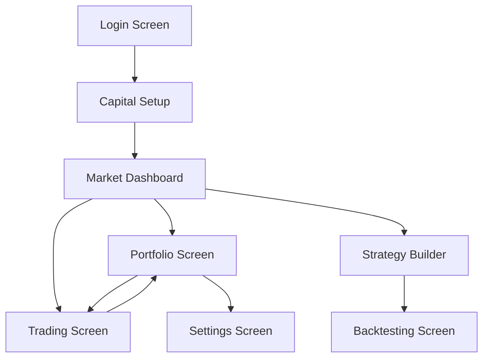

## 1. Product Overview
A paper-trading intraday market dashboard Android app for the Indian stock market (NSE) that allows users to practice trading with virtual money. Users can track live prices, manage portfolios, build trading strategies, and backtest them using historical data without risking real money.

Target users: Indian stock market enthusiasts, beginner traders, and those who want to practice intraday trading strategies risk-free.

## 2. Core Features

### 2.1 User Roles
| Role | Registration Method | Core Permissions |
|------|---------------------|------------------|
| Trader | OAuth 2.0 (Google Sign-In) | Full app access, portfolio management, strategy building, backtesting |

### 2.2 Feature Module
The paper trading app consists of the following main screens:
1. **Login Screen**: Google OAuth authentication, session management
2. **Capital Setup Screen**: Initial capital configuration, editable settings
3. **Market Dashboard**: Live price tracking, market overview, symbol watchlist
4. **Portfolio Screen**: Holdings management, P&L tracking, transaction history
5. **Trading Screen**: Buy/sell orders, order placement, position management
6. **Strategy Builder**: Create and store intraday strategies with conditions
7. **Backtesting Screen**: Historical strategy testing, performance metrics

### 2.3 Page Details
| Page Name | Module Name | Feature description |
|-----------|-------------|---------------------|
| Login Screen | OAuth Authentication | Implement Google Sign-In integration, handle secure session tokens, persist user authentication state locally |
| Capital Setup Screen | Initial Configuration | Prompt for starting capital on first launch, allow capital editing in settings, display available balance, invested amount, and total equity |
| Market Dashboard | Live Market Data | Fetch NSE stocks, NIFTY (^NSEI), BANKNIFTY (^NSEBANK) data from Yahoo Finance, display LTP, OHLC (5-minute candles), day high/low, refresh every 1 minute |
| Market Dashboard | Technical Indicators | Calculate and display VWAP, RSI(14), percentage change, highlight bullish/bearish conditions with visual indicators |
| Portfolio Screen | Holdings Management | Create multiple portfolios, add NSE symbols, track buy/sell transactions, show unrealized and realized P&L |
| Portfolio Screen | Paper Trading | Execute buy orders (deduct from balance, store price/quantity/timestamp), execute sell orders (calculate P&L, add back to balance), auto-refresh every 1 minute |
| Trading Screen | Order Placement | Select symbol from watchlist, enter quantity, preview order, confirm buy/sell execution, show current market price |
| Strategy Builder | Strategy Creation | Create BUY setups with conditions (5-min candle above ORH, retest holds, above VWAP, RSI>50, supportive BankNifty), create SELL setups with opposite conditions |
| Strategy Builder | Risk Management | Set stop-loss below ORH/retest low for BUY, above ORL/retest high for SELL, define targets (T1=1×SL, T2=1.5×SL with trailing) |
| Backtesting Screen | Historical Testing | Input strategy, symbol, date range, fetch 5-minute Yahoo Finance data, calculate total trades, win ratio, max drawdown, net P&L, generate equity curve |
| Settings Screen | User Preferences | Edit capital amount, manage portfolios, clear cache, view disclaimers, logout functionality |

## 3. Core Process

### User Flow
1. **First-time User**: Google Sign-In → Set Initial Capital → View Market Dashboard → Create Portfolio → Start Paper Trading
2. **Returning User**: Auto-login → View Portfolio → Execute Trades → Monitor P&L → Build Strategies → Backtest

### Trading Flow
Market Dashboard → Select Symbol → Trading Screen → Place Order → Portfolio Update → P&L Calculation

### Strategy Development Flow
Strategy Builder → Define Conditions → Save Strategy → Backtesting Screen → Select Strategy → Run Backtest → View Results

## 4. User Interface Design

### 4.1 Design Style
- **Primary Colors**: Deep green (#2E7D32) for profits, red (#D32F2F) for losses, blue (#1976D2) for primary actions
- **Secondary Colors**: Light gray (#F5F5F5) backgrounds, dark gray (#424242) text
- **Button Style**: Rounded corners (8dp), Material Design elevation
- **Fonts**: Roboto family, 14sp for body text, 18sp for headers, 12sp for timestamps
- **Layout**: Card-based with RecyclerView for lists, bottom navigation for main sections
- **Icons**: Material Design icons, green up arrows for gains, red down arrows for losses

### 4.2 Page Design Overview
| Page Name | Module Name | UI Elements |
|-----------|-------------|-------------|
| Login Screen | OAuth Button | Centered Google Sign-In button with logo, minimal design, app branding |
| Market Dashboard | Symbol Cards | Horizontal scrolling watchlist cards showing LTP, change%, RSI, VWAP with color-coded indicators |
| Portfolio Screen | Holdings List | Expandable cards showing symbol, quantity, avg price, current price, P&L with green/red background |
| Trading Screen | Order Form | Number input for quantity, current price display, BUY/SELL buttons with confirmation dialog |
| Strategy Builder | Condition Builder | Form inputs for each condition, dropdown selectors, validation indicators, save button |
| Backtesting Screen | Results Display | Summary cards for metrics, line chart for equity curve, date range picker |

### 4.3 Responsiveness
Mobile-first design optimized for Android phones (5-7 inch screens), supports both portrait and landscape orientations, touch-optimized with appropriate tap targets (48dp minimum), responsive layouts using ConstraintLayout and percentage-based sizing.

### 4.4 Disclaimer Notice
Persistent disclaimer banner stating "Paper Trading Only - No Real Money" with link to full disclaimer in settings.